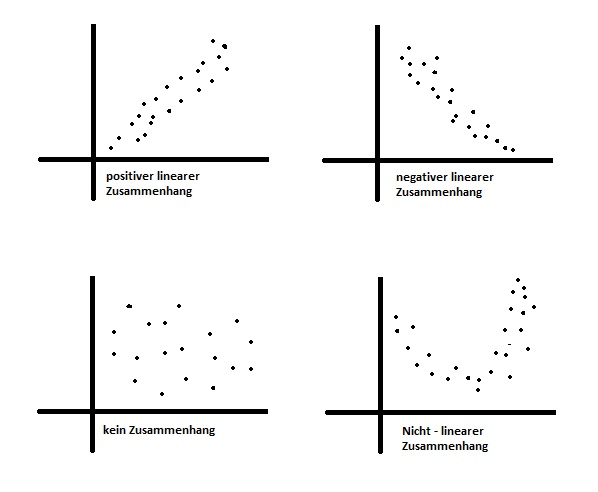

Datensatz: Guns (library AER)

Var 1 = income (unabhängig: Realeinkommen pro Kopf je US Staat) <br>
Var 2 = violent (abhängig: Rate der Gewalttaten = Vorfälle je 100.000 Einwohner)

# Allgemeine Studienbeschreibung

In der vorliegenden Studie beschäftigen wir uns mit der Kriminalität in den USA. Hierbei hat uns insbesondere interessiert:<br>

+ Unterschiede in der Gewaltrate in Bezug auf das Wahlverhalten (Aufgabe 6).<br>
+ Zusammenhänge in der Gewaltrate in Bezug auf das Realeinkommen pro Kopf (Aufgabe 3).<br>
+ Unterschiede in der Gewaltrate, wenn es ein Gesetz im jeweiligen US Bundesstaat gibt, welches das Tragen von Waffen in der Öffentlichkeit erlaubt (Aufgabe 4).<br>
+ Signifikante Anstiege in der Inhaftierungsrate zwischen den Jahren 1979 und 1999 (Aufgabe 5).<br>

Um diese Fragen zu beantworten haben wir uns für den Datensatz "Guns" des RStudio Packetes "AER" entschieden. Das Wahlverhalten je Bundesstaat wurde dem Datensatz "presidentialElections" aus dem der Library "pscl" entnommen.

Der "Guns" Datensatz enthält Daten eines balancierten Panels mit Daten aus den 50 US Bundesstaaten sowie des Districts "Columbia" (insgesamt 51 Staaten) zu den Jahren 1977 bis 1999. Der presidentialElections Datensatz beinhaltet Daten zum Anteil der für die demokratische Partei abgegebenen Stimmen in den Jahren 1932 bis 2016 je Bundesstaat sowie des Districtss "Columbia".

Folgende Variablen wurden im Datensatz verwendet:

+ income (Realeinkommen pro Kopf je US Staat) -> verhältnisskaliert
+ law (Hat der Staat ein Gesetz, welches das öffentliche Tragen von Waffen in dem betreffenden Jahr erlaubt) -> nominalskaliert
+ prisoners (verurteilte Häftlinge je 100.000 Einwohner) -> verhältnisskaliert
+ violent (Rate der Gewalttaten = Vorfälle je 100.000 Einwohner) -> verhältnisskaliert
+ demVote (Anteil der für die Demokraten abgegebenen Stimmen) -> verhältnisskaliert
+ year (Jahr 1979 vs. 1999) -> intervallskaliert, im Subset ordinalskaliert

# Vorbereitung

## Bibliotheken

```{r}
library(dplyr) # <%<
library(ggplot2) # Diagramme
library(car) # Scatterplot
library(psych) # deskritpive Statistik
```

## Datenimport

```{r}
guns <- read.csv('Guns.csv')
guns
```


## Explorative Datenanalyse

Bei der ersten Auftragung der Daten fiel direkt auf, dass es eine Reihe von Daten gab, die im allgemeinen Scatterplot der in Frage kommenden abhängigen und unabhängigen Variablen sehr auffiel. Dieser Datensatz wurde als die Daten von Washington, DC identifiziert und ist im folgenden bereits pink eingefärbt, um die Auffäligkeit zu demonstrieren. Einzig beim Einkommen sind die Daten nicht als klare Ausreißer zu erkennen.

```{r Scatterplot alle vs DC 4, fig.width=10}
#Benötigt CAR
scatterplotMatrix(~violent+prisoners+income+year | (state=="District of Columbia"),
regLine=TRUE,
smooth=FALSE,
diagonal=list(method="density"),
by.groups=TRUE,
data=guns) #Achtung hier liegt die Tabelle
```

Washington, DC stellt im Konstrukt der Vereinigten Staaten von Amerika als Bundesdistrikt eine Besonderheit dar. Der Distrikt ist kein Bundesstaat und ist keinem zugehörig und direkt der Regierung unterstellt. Das erklärt die Sonderrolle.

Im folgenden Trennen wir die Daten vom "District of Columbia" daher aus dem Datensatz heraus und arbeiten in allen Aufgaben ohne sie weiter, da wir eine Vergleichbarkeit nicht für gegeben halten.

```{r Abtrennung von DC}
gun_mod <- guns[!(guns$state == "District of Columbia"),]
gun_dc <- guns[(guns$state == "District of Columbia"),]
```

Verteilungen ohne District Columbia

```{r}
scatterplotMatrix(~violent+income+prisoners+year,
smooth=FALSE,
diagonal=list(method="density"),
data=gun_mod) 
```

# Aufgabe 3) Zusammenhangshypothese 

Datensatz: Guns (library AER)

Var 1 = income (unabhängig: Realeinkommen pro Kopf je US Staat) <br>
Var 2 = violent (abhängig: Rate der Gewalttaten = Vorfälle je 100.000 Einwohner)

Die Fragestellung dieser Aufgabe untersucht, ob es einen Zusammenhang zwischen dem Realeinkommen pro Kopf und der Rate der Gewalttaten gibt.

## 1)	Hypothese 

+ Ho: Es gibt keinen Zusammenhang zwischen dem Realeinkommen pro Kopf (income) und der Rate der Gewalttaten (violent). $r = 0$
+ H1: Es gibt einen Zusammenhang zwischen dem Realeinkommen pro Kopf  (income) und der Rate der Gewalttaten (violent). $r \neq 0$

## 2)	Voraussetzungen

+ Die Variablen sind mindestens intervallskaliert -> Ja, beide Varibalen sind verhältnisskaliert.
+ Die Variablen sind normalverteilt (n>30)-> siehe Histogramm
+ Der untersuchte Zusammenhang zwischen den Variablen muss linear sein -> siehe Streudiagramm

## 3)	Grundlegende Konzepte: Was ist Pearson? 

Die Korrelation, auch bivariate Korrelation oder Produkt-Moment-Korrelation genannt, beschreibt den Zusammenhang von zwei intervallskalierten Merkmalen/Variablen einer Zufallsstichprobe. Eine Möglichkeit, die Stärke des Zusammenhangs zu bestimmen, ist die Berechnung des Korrelationskoeffizienten r nach Bravais und Pearson. Voraussetzung ist hierbei, dass es sich um einen linearen Zusammenhang zwischen den analysierten Merkmalen handelt. Zusätzlich wird hier ein ungerichteter Zusammenhang untersucht, d.h. die Variablen sind unabhängig voneinander und folglich werden keine kausalen Aussagen gemacht.

Der Korrelationskoeffizient r kann Werte zwischen -1 und +1 annehmen und ist unabhängig von der Maßeinheit. Ein Wert von -1 beschreibt eine perfekt negative Korrelation und ein Wert von +1 eine perfekt positive Korrelation. Bei r = 0 liegt kein linearer Zusammenhang zwischen den Variablen vor. 

```{r figurename, echo=FALSE, fig.cap="Entscheidungsweg", out.width = '90%'}

```

Achtung: Es kann dennoch ein Zusammenhang bestehen. Dieser ist dann allerdings nicht linear, sondern z.B. exponentiell. Um dies zu prüfen, müssen dann andere Tests angeschlossen werden.

Bei einer Korrelation wird der ungerichtete lineare Zusammenhang zweier Variablen untersucht. "Ungerichtet" bedeutet, dass nicht von einer abhängigen und einer unabhängigen Variable gesprochen wird. Es werden folglich keine kausalen Aussagen gemacht.

Es besteht das Risiko einer Scheinkorrelation.

Die Fragestellung einer Korrelation wird oft so verkürzt:
**"Gibt es einen Zusammenhang zwischen zwei Variablen?"** 


## 4)	Grafische Veranschaulichung des Zusammenhangs

### Histogramme

```{r}
x <- gun_mod$income 

h<-hist(x, breaks=, col="lightblue", xlab="Realeinkommen pro Kopf",
main="Verteilung Realeinkommen pro Kopf",
ylab= "Anzahl")
xfit<-seq(min(x),max(x),length=40)
yfit<-dnorm(xfit,mean=mean(x),sd=sd(x))
yfit <- yfit*diff(h$mids[1:2])*length(x)
lines(xfit, yfit, col="blue", lwd=2) 
```

Die Variable income ist augenscheinlich normalverteilt. Sie zeigt eine bauchige Mitte und geht an den Rändern gegen null. Auch die Stichprobengröße mit n>30 spricht dafür. 

```{r}
x <- gun_mod$violent 

h<-hist(x, breaks=, col="lightblue", xlab="Rate der Gewalttaten",
main="Verteilung Rate der Gewalttaten",
ylab= "Anzahl")
xfit<-seq(min(x),max(x),length=40)
yfit<-dnorm(xfit,mean=mean(x),sd=sd(x))
yfit <- yfit*diff(h$mids[1:2])*length(x)
lines(xfit, yfit, col="blue", lwd=2) 
```
Die Variable violent ist augenscheinlich normalverteilt. Sie zeigt eine bauchige Mitte und geht an den Rändern gegen null. Auch die Stichprobengröße mit n>30 spricht dafür. 

### Scatterplot

```{r}
ggplot(gun_mod, aes(x = income, y = violent)) + geom_point(size = 2, col = "cadetblue") + geom_smooth(method = "lm", col = "cornflowerblue")
```

Die Punktwolke des Streudiagramms ist breit aufgefächert. Dennoch zeigt das Streudiagramm eine tendenziell positive lineare Beziehung zwischen den beiden Variablen. Das heisst, die beiden Variablen korrelieren vermutlich. 

## 5)	Deskriptive Statistik

**Subset Erstellung für eine bessere Übersichtlichkeit**

```{r}
gun_pearson <- gun_mod[,c("income", "violent")]
head(gun_pearson)
```

```{r}
describe(gun_pearson)
```

Im Mittel liegt die das Realeinkommen pro Kopf bei 13622.84 US Dollar pro Jahr (SD = 2440.78, n = 1150)). Die Rate der Gewalttaten in Vorfällen je 100.000 Einwohner liegt durchschnittlich bei 472.16 Vorfällen pro Jahr (SD = 247.02, n = 1150).

## 6)	Ergebnisse der Korrelationsanalyse

```{r}
test <- cor.test(gun_pearson$income, gun_mod$violent)
test
```
Der R-Output in Abbildung gibt den Korrelationskoeffizienten sowie den p-Wert (Signifikanz) und die Stichprobengrösse n wieder. 
Es liegt ein signifikanter, positiver-linearer Zusammenhang zwischen dem Realeinkommen pro Kopf und der Rate der Gewalttaten vor (r = .3011, p < 2.2e-16, n = 1150). 

Da r einen positiven Wert aufweist, kann von einem positiven linearen und signifikanter Zusammenhang zwischen dem Realeinkommen pro Kopf und der Rate der Gewalttaten ausgegangen werden. Das bedeutet: Je höher das Realeinkommen, detso höher die Rate der Gewalttaten. Der Zusammenhang ist inhaltlich jedoch schwer zu interpretieren. Es liegt ggf. eine Scheinkorrelation vor.

## 7)	Berechnung des Bestimmtheitsmasses

Aus der Korrelation lässt sich durch quadrieren das Bestimmtheitsmass berechnen:

$Bestimmtheitsmasses = r^2 *100 = {0.30118}^2*100$

```{r}
rbestimmt <- test$estimate^2*100
sprintf("Das Bestimmtheitsmaß liegt bei %.2f Prozent.", rbestimmt)
```
Wird dieser Wert mit 100 multipliziert, so ergibt sich ein Prozentwert. Dieser gibt an, welcher Anteil der Varianz in beiden Variablen durch gemeinsame Varianzanteile determiniert wird. Für das vorliegende Beispiel beträgt der Anteil der gemeinsamen Varianz 9,06%.

## 8)	Berechnung der Effektstärke

Um die Bedeutsamkeit eines Ergebnisses zu beurteilen, werden Effektstärken berechnet. In dieser Aufgbae ist die Korrelation der beiden Variablen signifikant, doch es stellt sich die Frage, ob der Zusammenhang gross genug ist, um ihn als bedeutend einzustufen. Der Korrelationskoeffizient r von Bravais-Pearson stellt selbst ein Mass für die Effektstärke dar.

```{r}
sprintf("Die Effektstärke liegt bei %.4f.",test$estimate)
```
Um zu bestimmen, wie gross der gefundene Zusammenhang ist, kann man sich an der Einteilung von Cohen (1992) orientieren:

$$
\begin{align}
\text{Schwacher Effekt: } 0.10 &< ||r|| < 0.30             \\
\text{Schwacher bis mittlerer Effekt: } 0.30 &= ||r||      \\
\text{Mittlerer Effekt: } 0.30 &< ||r|| < 0.50             \\
\text{Mittlerer bis starker Effekt: }0.50 &= ||r||         \\
\text{Starker Effekt: } 0.50 &< ||r||        
\end{align}
$$
Damit entspricht ein Korrelationskoeffizient(r) von .3011 einem schwachen bis mittleren Effekt.

## 9)	Eine Aussage

Im Mittel liegt die das Realeinkommen pro Kopf bei 13622.84 US Dollar pro Jahr (SD = 2440.78, n = 1150)). Die Rate der Gewalttaten in Vorfällen je 100.000 Einwohner liegt durchschnittlich bei 472.16 Vorfällen pro Jahr (SD = 247.02, n = 1150).

Das Realeinkommen pro Kopf je US Staat und die Rate der Gewalttaten in Vorfälle je 100.000 Einwohner in den Jahren 1977 bis 1999 korrelieren linear-positiv signifikant (r = .3011, p < 2.2e-16, n = 1150). Das Ergebnis legt nahe, dass je höher das Realeinkommen pro Kopf in einem US Staat ist, desto höher ist die Rate der Gewaltaten je 100.000 Einwohner. Der Zusammenhang ist inhaltlich jedoch schwer zu interpretieren. Es liegt ggf. eine Scheinkorrelation vor.

9,06% der Streuung der gemeinsamen Varianz kann durch das Einkommen und die Gewaltrate erklärt werden. Dabei handelt es sich nach Cohen (1992) um einen schwachen bis mittleren Effekt. 

H0 kann damit verworfen werden.
